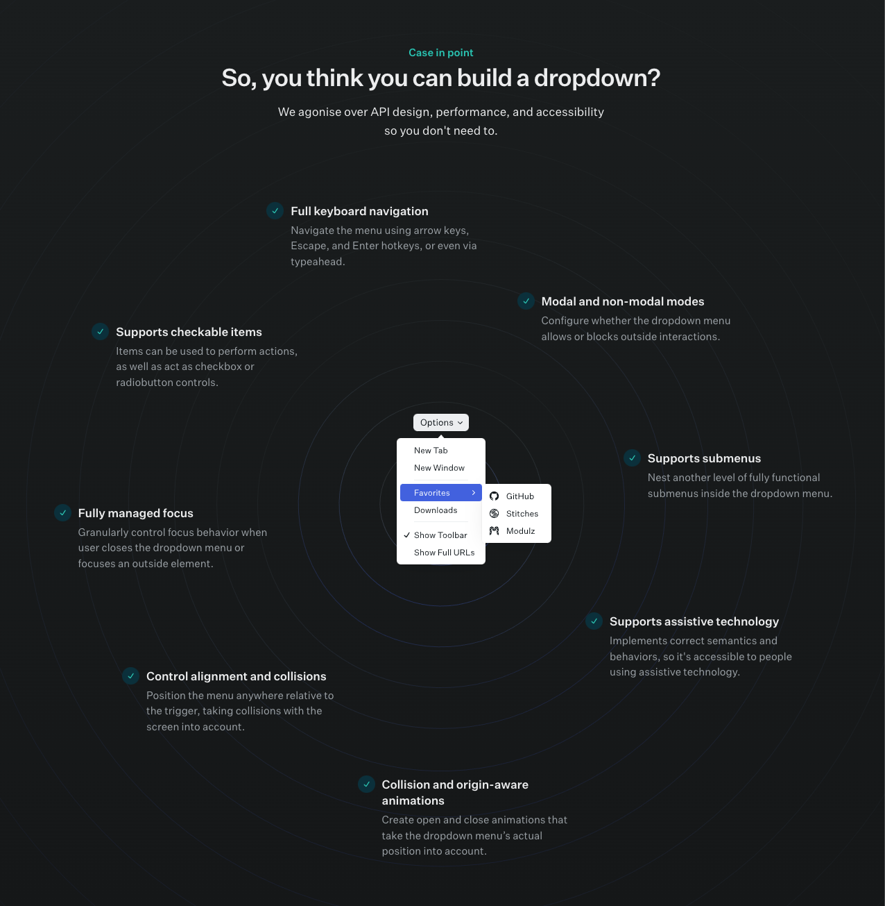

# Radix UI - Proof of Concept with Styled Components

## What is Radix UI?

"Unstyled, accessible components for building high‑quality design systems and web apps in React."

## Accessibility and Radix UI

Accessibility should be something we take very seriously and should be baked into our development process from the start, not just an afterthought.

Building fully accessible and compliant UI components is challenging and time-consuming - especially when looking at more complex elements such as dropdown menus, modals, tabs, dialogs etc.

Nailing accessibility details and complex logic sucks time away from product feature development.

Out of the box, Radix UI provides:

✅ WAI-ARIA compliant components

✅  Keyboard navigation

✅ Focus management

✅ Screen reader tested

## Developer Experience and Integration with Our Stack

Radix UI is used by engineers at Vercel (creators of Next.js) and Codesandbox.

They provide a fully typed API in TypeScript purposefully built for React.

All components share a similar API, allowing for a consistent and predictable developer experience. 

✅ Unstyled (Styled Components compatible)

✅ Incremental Adoption - each individual component is it's own package 

✅ Detailed documentation and TypeScript Support

## Links

[Radix UI Website](https://www.radix-ui.com/)

[Raxix UI Github](https://github.com/radix-ui/primitives)